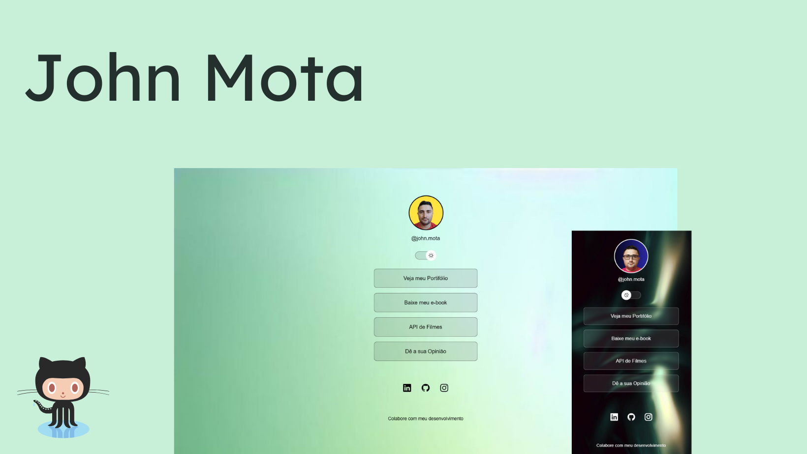

<h1 align="center"> Portifólio John Mota </h1>

Programa exclusivo e criado para apresentar minhas skills como desenvolvedor  

  <a href="#-tecnologias">Tecnologias</a>&nbsp;&nbsp;&nbsp;|&nbsp;&nbsp;&nbsp;
  <a href="#-projeto">Projeto</a>&nbsp;&nbsp;&nbsp;|&nbsp;&nbsp;&nbsp;
  <a href="#-layout">Layout</a>&nbsp;&nbsp;&nbsp;|&nbsp;&nbsp;&nbsp;
  <a href="#memo-licença">Licença</a>

  

 

  

## 🚀 Tecnologias

Esse projeto foi desenvolvido com as seguintes tecnologias:

- HTML e CSS
- TypeScript
- Git e Github
- Angular

## 💻 Projeto

Este projeto  é um agregador de links para usar como cartão de visitas online.

- [Acesse o projeto finalizado, online](#)

- [Linkedin](https://www.linkedin.com/in/john-mota-026044203/)

## :memo: Licença

Esse projeto está sob a licença MIT.

---

Feito com ♥ John Mota :wave: [Participe da nossa comunidade!](https://instagram.com/john.mota?utm_source=qr&igshid=ZDc4ODBmNjlmNQ%3D%3D)